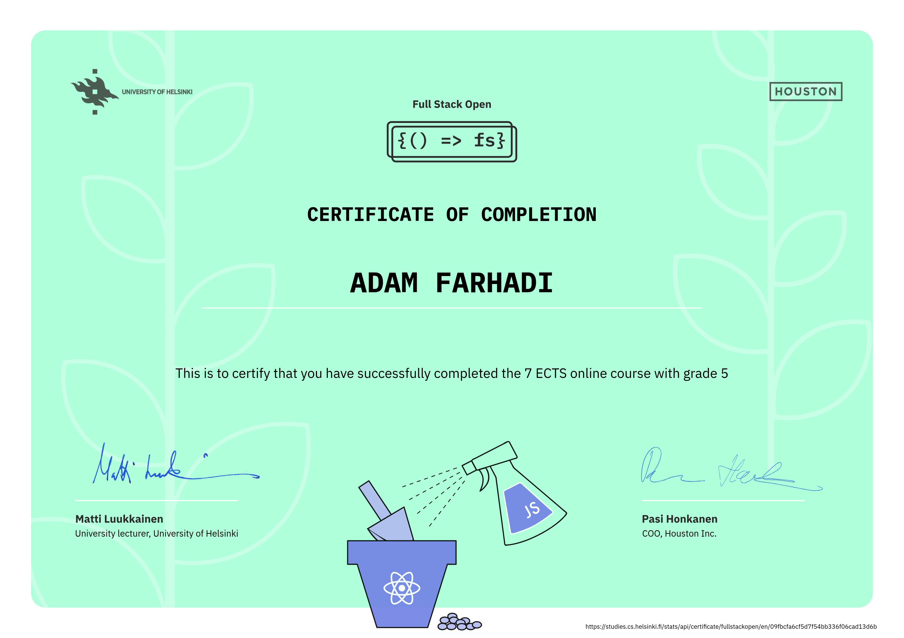

# Full Stack Open - Deep Dive Into Modern Web Development
My solutions for the full stack web development course offered by Open University at the University of Helsinki. A link to the course material can be found [here](https://fullstackopen.com/en).

## Part 1 - [Introduction to React](https://fullstackopen.com/en/part1)
* Exercises done: 14/14
* Key tools/frameworks/libraries used: React, Vite

## Part 2 - [Communicating with server](https://fullstackopen.com/en/part2)
* Exercises done: 20/20
* Key tools/frameworks/libraries used: React, Axios

## Part 3 - [Programming a server with NodeJS and Express](https://fullstackopen.com/en/part3)
* Exercises done: 22/22
* Key tools/frameworks/libraries used: Node.js, Express, MongoDB, Mongoose, ESLint

## Part 4 - [Testing Express servers, user administration](https://fullstackopen.com/en/part4)
* Exercises done: 23/23
* Key tools/frameworks/libraries used: Node.js, Express, Mongoose, Node.js Test Runner, Supertest

## Part 5 - [Testing React apps](https://fullstackopen.com/en/part5)
* Exercises done: 23/23
* Key tools/frameworks/libraries used: React, Node.js, Vitest, Playwright

## Part 6 - [Advanced state management](https://fullstackopen.com/en/part6)
* Exercises done: 24/24
* Key tools/frameworks/libraries used: React, Redux, TanStack Query

## Part 7 - [React router, custom hooks, styling app with CSS and webpack](https://fullstackopen.com/en/part7)
* Exercises done: 21/21 
* Key tools/frameworks/libraries used: React, TanStack Query, React Router, Prettier, Material UI

